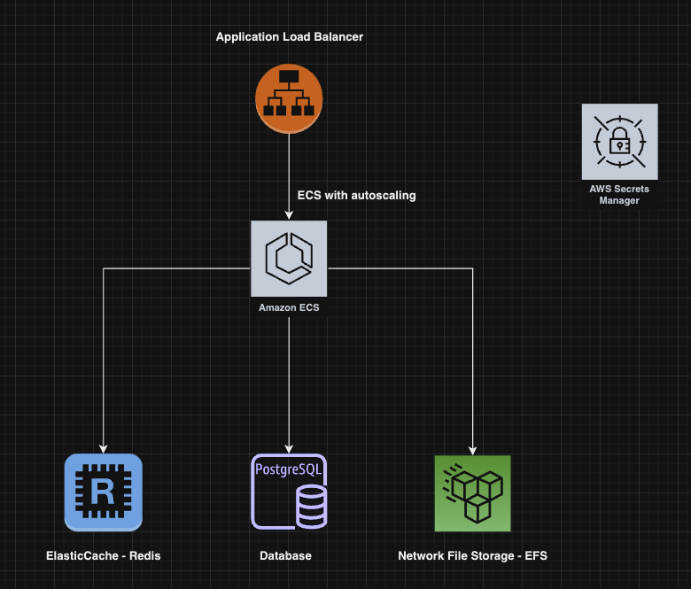
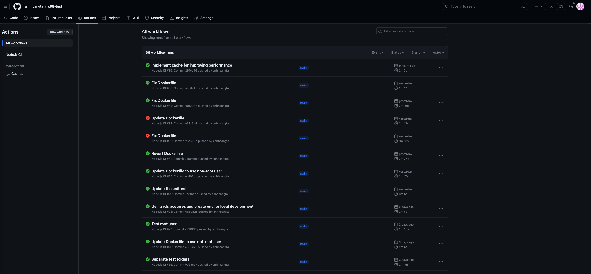
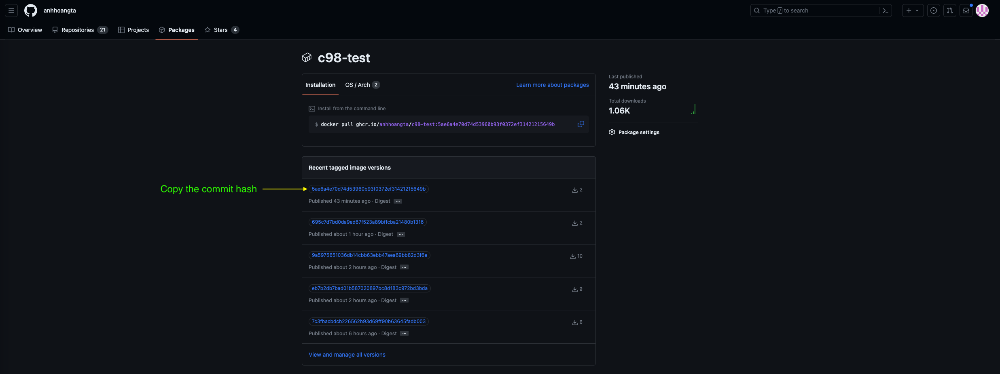
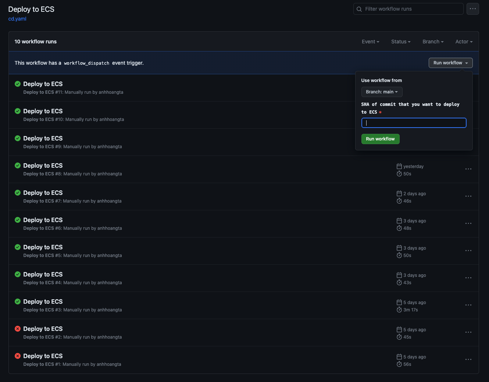
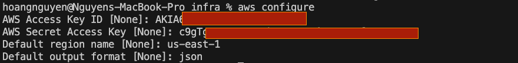
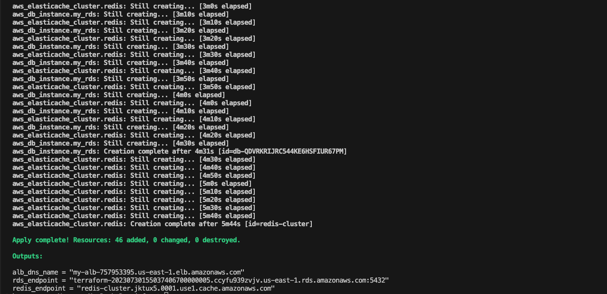
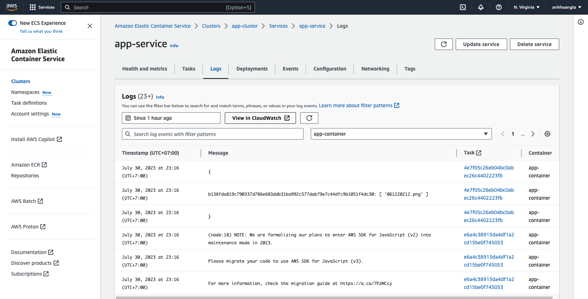

 # Deploy infrastructure and application to AWS

## Architecture:

- ALB: to distribute traffic to ECS tasks.
- ECS with autoscaling to allow horizontal scaling. By default, the min=1, max=10 tasks.
- Redis: cache for get file function to improve the performance. Cache technique is always hard, this is a simple implementation, in the real project we need to do a lot.
- EFS: use to share the uploads folder between tasks. It's also the persistent volume solution. We can improve more by caching the image, video files in S3 and use CDN to enhance perfomance. We can also use S3 to store the uploaded files with many benefits.
- AWS Secrets Manager: I use it fot sensitive information management. This is very important in reality case then I have to demo to use it.
## CI/CD flow:
- When we push the new code to main branch, the CI pipeline will automatically run: https://github.com/anhhoangta/c98-test/actions

Once finished, it will push the docker image to the github artifactory: https://github.com/users/anhhoangta/packages/container/package/c98-test. We get the image tag to prepare for deploying to AWS.

- You can check the pipeline CD in Github Actions of infrastructure repository: https://github.com/anhhoangta/c98-test-infra/actions/workflows/cd.yaml. Paste to the CD pipeline the commit hash that you decide to deploy.


## Prepare:
- Clone c98-test and c98-test-infra repositories, open two terminal tabs inside the root directory of each. We'll name it as infra and app tab correspondingly.
```
git clone https://github.com/anhhoangta/c98-test
git clone https://github.com/anhhoangta/c98-test-infra
```
- AWS credentials using for infrastructure and application: for demostration, we can create an access key with this policy: AdministratorAccess. In reality, we need to follow the Grant Least Privilege rule to ensure that the access key has enough permissions only.
    - Create an IAM User with AdministratorAccess policy: https://docs.aws.amazon.com/IAM/latest/UserGuide/id_users_create.html#id_users_create_console. On Step 7, you can choose AdministratorAccess policy to attach.
    - Under this user, you can create an user access key: https://docs.aws.amazon.com/IAM/latest/UserGuide/id_credentials_access-keys.html#Using_CreateAccessKey
- Install:
    - AWS CLI: 
        - Follow this guidance https://docs.aws.amazon.com/cli/latest/userguide/getting-started-install.html to install AWS CLI version 2.x
        - Run this command to config your access key which you created in previous steps.
        ```
        aws configure
        ```
        
    - Terraform: follow this docs https://developer.hashicorp.com/terraform/tutorials/aws-get-started/install-cli
    - Docker and docker-compose: only for local development

## Run the CI:
The CI pipeline will automatically run each time we push new code to main branch. After the CI finishing, we can check the result of Unittest and Code Coverage and Sonarqube test. If everything is OK, we'll pick the commit hash. We'll then use it as the image tag in the CD pipeline.

For running the CI, we need to create some secrets inside the app repository:
- SONAR_TOKEN: use for sonarqube. You can create an free account on https://sonarcloud.io/ then get the token.
- GH_TOKEN: github token, we'll use it to login to ghcr.io, the github artifactory which we use to push the image
- AWS_ACCESS_KEY_ID and AWS_SECRET_ACCESS_KEY: we'll pass it as env inside the docker image which the application need to interact with AWS via aws-sdk of nodejs.

## Deploy infrastructure:
- Create credentials in aws secrets manager: I'm using AWS Secrets Manager to manage our credentials include: database, redis and aws access key. Run these commands in infra tab (only for the first time):
```
export AWS_ACCESS_KEY_ID=<your_access_key>
export AWS_SECRET_ACCESS_KEY=<your_secret_key>
export AWS_DEFAULT_REGION="us-east-1"
export TF_STATE_BUCKET=<your_bucket_name> 
export DB_NAME=<db_name>
export DB_USER=<db_user>
export DB_PASSWORD=<db_pass>
chmod +x ./scripts/* && ./scripts/create_creds.sh

sed -i "s/terraform-c98-test/$TF_STATE_BUCKET/" backend.tf 
sed -i "s/us-east-1/$AWS_DEFAULT_REGION/" backend.tf
/* on MacOS, change the commands to:
sed -i "" "s/terraform-c98-test/$TF_STATE_BUCKET/" backend.tf
sed -i "" "s/us-east-1/$AWS_DEFAULT_REGION/" backend.tf
*/

terraform init
terraform plan
terraform apply --auto-approve
```
- The output in sucess case looks like that:

- We can see three output values:
    - alb_dns_name: in real case, we'll assign a domain with the CNAME point to it and setup SSL also. Because of demonstration, we'll skip it. In our situation, we'll use it to test the application.
    - Get the rds_endpoint and redis_endpoint and update the credentials. We use these credentials for our application.
```
export DB_HOST=<db_host from terraform output>
export DB_PORT=5432
export REDIS_HOST=<redis_host from terraform output>
export REDIS_PORT=6379
./scripts/create_creds.sh
```
- Finally, update our application with the right image tag which we get from github artifactory page as previous step. Also from now on, after the CI finishing, we can deploy with the CD or directly from this infra folder (deploy directly in local machine is not recommended):
```
terraform apply -var="docker_image_tag=261ea4699a2d1214ca03e372b90f3037304d1bab" -auto-approve
```

## Testing:
- Local environment: In the app terminal tab, run this:
```
docker-compose up
```
And we can test the the app directly and quickly in local at http://localhost:3000

- API: Import this Postman's collection to make the test directly what I did. Or you can replace the urls with your own one which get from above.
    - https://www.dropbox.com/scl/fi/bpnza4dzyac708oi1bqh0/c98-test.postman_collection.json?dl=0&rlkey=be70qxy26ebu9mzm93enca604

- Logs: you can access the ECS part in your AWS account to see the logs.


## Clean up
Running these commands inside infra tab:
```
terraform destroy
./scripts/delete_creds.sh
```